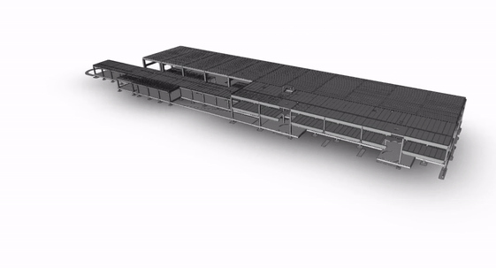
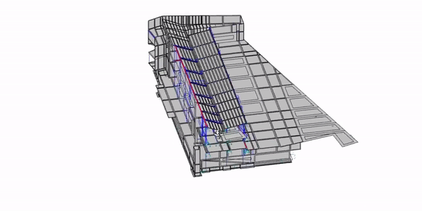
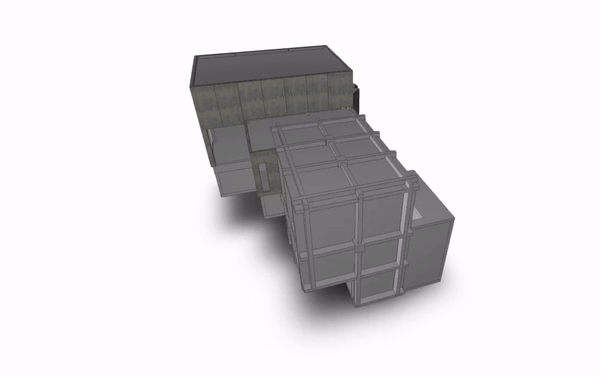
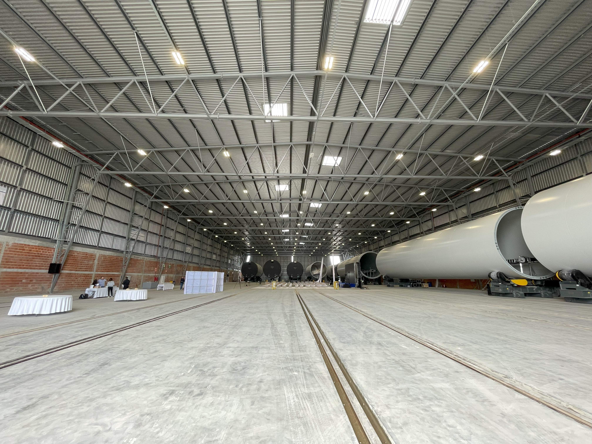
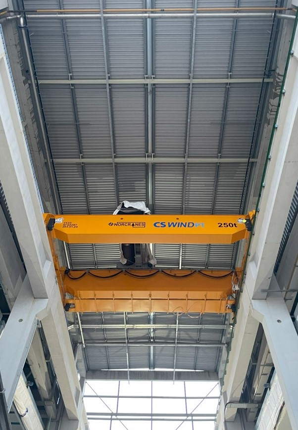
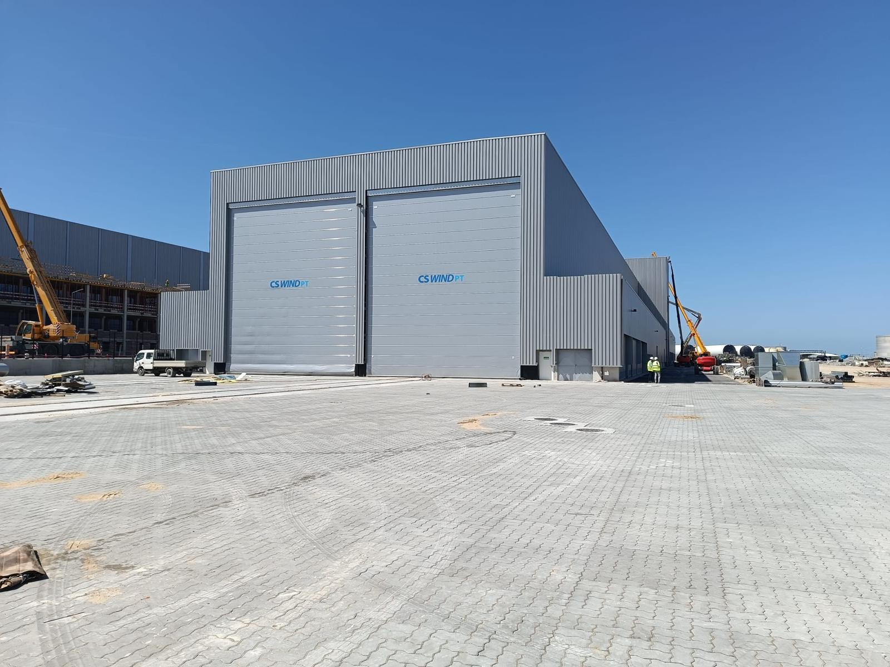
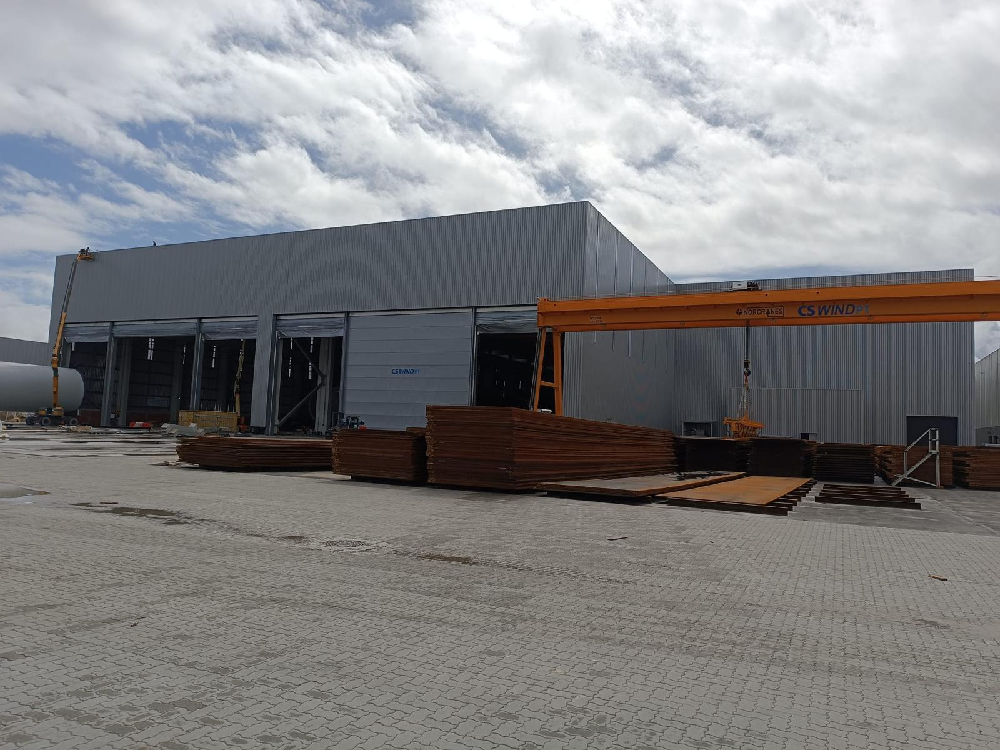
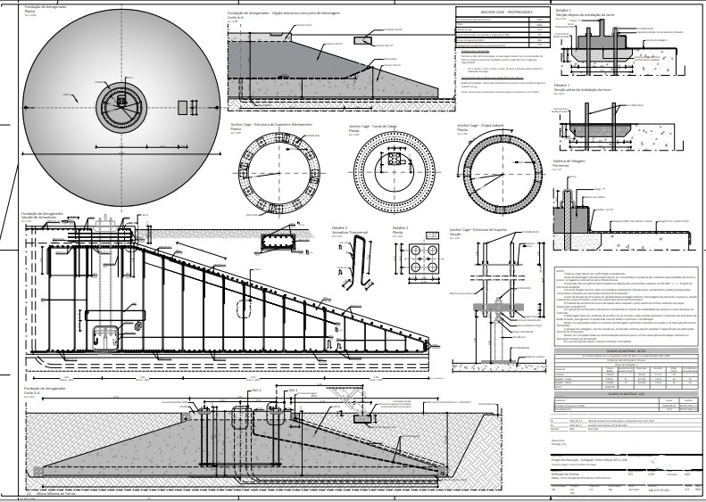
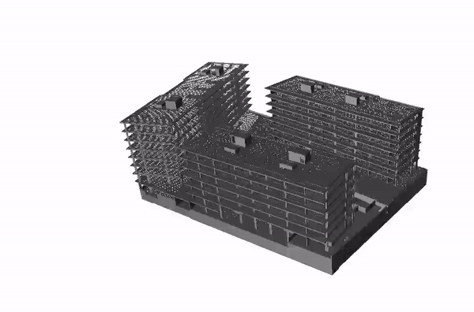

# Structural Engineer

## Education
- **Master in Civil Engineering Structures**
  - FEUP - University of Porto (_2020 - PORTUGAL_)
- **Bachelor’s Degree in Civil Engineer** 
  - UDESC - State University of Santa Catarina (_2016 - BRAZIL_)

## Work Experience
* **2020-PRESENT - VE-CONCEPT** - Structural Engineer and BIM Manager
* **2017-2020 - INDEPENDENT** - Civil Engineer
* **2016-2017 - MRV ENGENHAIRA** - Intern / Production Analyst 

## Core Projects
### APDL - CENTRO INSPETIVO DO PORTO DE LEIXÕES (CIPL)
- **Description:** 1.2M€ Structures and Foundation.
- **Structural type:** Precast Concrete. 
- **Project Environment:** Revit + CAD.
- **Activities:** 
  - BIM Modeling.
  - Concrete Design.

### ÁGUAS DE GAIA - SEDE DAS ÁGUAS DE GAIA
- **Description:** Headquarters of the water supply agency of Vila Nova de Gaia municipality of Porto,Portugal.
- **Estimated Cost:** 3.3€ Structures and Foundation.
- **Structural type:** Concrete and Precast Concrete.
- **Project Environment:** CAD.
- **Activities:** 
  - Concrete Design (Retaining walls, Flat Slabs, Beams and Columns).
  - Foundation Design (Piles and Shallow Foundation)
  - Desing connections for precast architectural elements.
  - Draw 2D details.
    

### FERPINTA - Bissau Abidjan
- **Description:** Facility of the FERPINTA Group in Abidjan, Bissau.
- **Estimated Cost:** 1.3M€ Structures and Foundation.
- **Structural type:** Steel.
- **Project Environment:** Tekla + CAD.
- **Activities:** 
  - Shallow Foundation Design.
  - Concrete Foundation for ground machinery.
  - Steel Design (2D Frame structure, Runway Beams, Facade Elements).
  - Desing steel connections.
  - Draw 2D details.

### OLIVEIRAS/EPAL - MINI-HIDRICA DA ASSEICEIRA 
- **Description:** This building holds a water turbine to generate energy from potable water due to a high slope region in the pipeline. 
- **Estimated Cost:** 450k€ Structures and Foundation
- **Structural type:** Precast and In-Situ Concrete + Steel.
- **Project Environment:** Revit + CAD.
- **Activities:** 
  - Foundation Slab Design.
  - Concrete Design (Water retaining walls, Columns, Beams, Slabs).
  - Steel Desing.
  - Revit Modelling.
  - Draw 2D details.

.jpg)

### CSWIND - UNIDADE INDUSTRIAL DA CSWIND-OFFSHORE EM ÍLHAVO
- **Estimated Cost:** 55M€ Structures and Foundation.
- **Structural type:** Precast and In-Situ Concrete and Steel.
- **Project Environment:** Tekla + CAD.
- **Activities:**
  - Design of concrete precast elemets for large wind pile factory, incluiding runway beams for cranes up to 250t and support columns with 26m heigh.
  - Shallow Foundation Design and Pile Design.
  - Project Coordination.
  - Design of a steel Frame warehouse with 52m free-span truss for a warehouse.
  - Design steel connections.
  - Design of steel support structures for large gates with dimensions up to 11x15m.
  - Draw 2D details and 3D modeling of structural elements.

### FINERGE - FUNDAÇÃO PARA AEROGERADOR Cypress-158
- **Description:** Optimization project of foundation for a wind turbine tower with 121 m height and rotor diameter of 158m in Portugal due to high prices due the war in Ukraine.
- **Estimated Cost Saving:** 80k€ per foundation.
- **Structural type:** Concrete.
- **Project Environment:** CAD.
- **Activities:** 
  - Shallow Foundation Design.
  - Draw 2D details.
.jpg)
.jpg)

### APDL - Porto Seco Guarda 
- **Description:** Railway facility to load cargo in the middle of the country and cary to the final port.
- **Estimated Cost:** 500k€ Structures and Foundation.
- **Structural type:** Concrete + Steel.
- **Project Environment:** Revit + CAD.
- **Activities:** 
  - Shallow Foundation Design.
  - Concrete design of small buildings.
  - Steel walkway desing, span over 12m.
  - Desing steel connections.
  - Draw 2D details.
 
### Kronos Homes - Lisboa - Zen Paço Lumiar
- **Description:** Three Residencial  buildings in Lisbon with 8 floors.
- **Estimated Cost:** 5.4 M€ Structures and Foundation.
- **Structural type:** Concrete + Steel.
- **Project Environment:** Revit + CAD.
- **Activities:** 
  - Shallow Foundation Design.
  - Steel Design (2D Frame structure, Facade Elements).
  - Desing steel connections.
  - Concrete design with special atention to the eurocode 8 requirements due to the high sismic action.
  - 3D modeling.
  - Draw 2D details.

### EFI - Cotovia - Sesimbra  
- **Description:** Three Residencial  buildings in Lisbon with 4 floors.
- **Description:** 2.3M€ Structures and Foundation.
- **Structural type:** Concrete.
- **Project Environment:** Revit + CAD.
- **Activities:** 
  - Shallow Foundation Design.
  - Concrete design with special atention to the eurocode 8 requirements due to the high sismic action.
  - 3D modeling.
  - Draw 2D details.
  
### Other Projects
- Nursing Home Building - Guarda/PT (EP)
- Single-family Detached Home (with black concrete exterior walls) - Porto/PT (EP)
- Day care center - Vila Nova Gaia/PT (EP)
- Concrete Residencial Building with 5 Levels + Underground Parking Lot - Lisbon/PT (EP)
- Nursing Home Building - Pombal/PT (EP)
- Steel Plataform -  Port of Leixões/PT (EP)
- Concrete Office Building with 14 floors - Gaia/PT (BFC)
- Concrete Residencial Building with 5 Levels + 2 Underground Parking Lot - Porto/PT (PL)
- Concrete Residencial Building with 5 Levels - Lisbon/PT (PL)
- Cable Supported for PV panels - Montclair/FR (BFC)
- Maternity Hospital - Coimbra/PT (PL)
- Concrete Residencial Building with 5 Levels - Lisbon/PT (PL)
- Foundation for Crane Strucuture - Porto/PT (EP)
- Metro Station in Paris - Paris/FR (BFC)
- Steel Isolated Roof for a container parking area - Port of Leixões/PT (EP)
- Radar connection to existing building - Port of Leixões/PT (EP)
- Concrete Residencial Building with 7 Levels + Underground Parking Lot - Lisbon/PT (PL)
#### EP - Execution Project
#### BFC - Biding for Construction
#### PL - Porject for licensing
 
