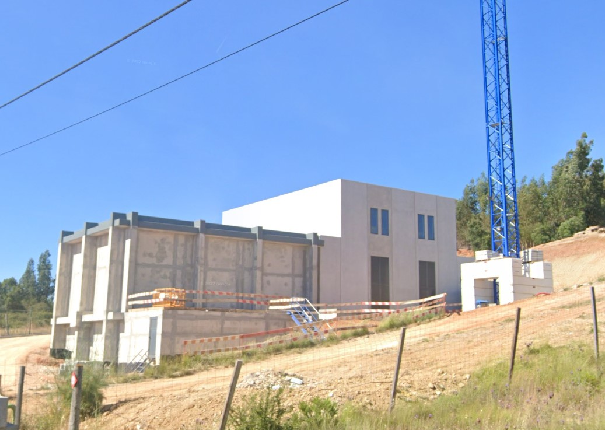
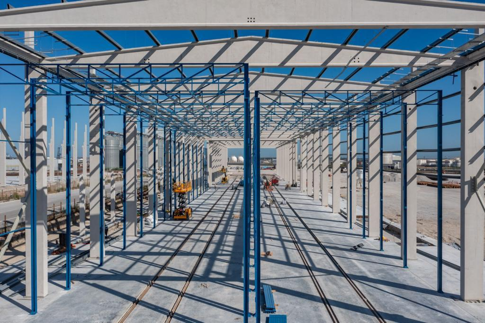

# Structural Engineer

## Education
Master in Civil Engineering Structures
FEUP - PORTO UNIVERSITY

## Work Experience
2020-PRESENT - VE-CONCEPT - STRUCTURAL ENGINEER AND BIM MANAGER
2017-2020 - INDEPENDENT - CIVIL ENGINEER
2016-2017 - MRV ENGENHAIRA - MEP AND PRODUCTION TECHNICAL

## Projects
### APDL - CENTRO INSPETIVO DO PORTO DE LEIXÕES (CIPL)

### ÁGUAS DE GAIA - CEDE DAS ÁGUAS DE GAIA

### FERPINTA - Bissau Abidjan

### OLIVEIRAS/EPAL - MINI-HIDRICA DA ASSEICEIRA 

### CSWIND - UNIDADE INDUSTRIAL DA CSWIND-OFFSHORE EM ÍLHAVO

### FINERGE - FUNDAÇÃO PARA AEROGERADOR GE 158

### CSWIND - UNIDADE INDUSTRIAL DA CSWIND-ONSHORE EM SEVER DO VOLGA

### OJE - Porto Seco do Entroncamento

### APDL - Porto Seco Guarda 

  

344 - B30 - Lar de idosos
322 - Cesar - Moradia Meirinhos
355 - Creches - Gaia
361 - EFI - HCC - Cotovia
366 - B30 - ERPI Pombal
368 - Ferpinta - Guine Bissau
389 - Inesctec - plataforma APDL
400 - Torre Centro Civico
420 - INVENIO-MG-Quinta do Pinheiro
434 - Kronos - Paço Lumiar
463 - Voltalia - Montclar
485 - Maternidade Coimbra
488 - Kronos - Planbelas
491 - INVENIO - Fund grua
500 - Bysteel - Gare Massy
511 - ETE - Parque Contentores - Lote 12
524 - APDL - Antena VTS
533 - IHRU - BAK - Quinta das Conchinhas
